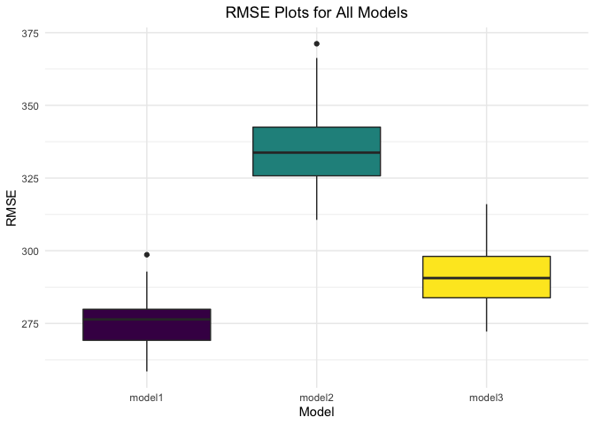

p8105_hw6_jdr2191
================

``` r
library(tidyverse)
library(purrr)
library(modelr)
library(viridis)
```

## Problem 1

**Load and clean the data for regression analysis (i.e. convert numeric
to factor where appropriate, check for missing data, etc.).**

``` r
birthweight_df = 
  read_csv("birthweight.csv") %>%
  mutate(babysex = factor(babysex, levels = c(1,2), labels = c("male", "female"))) %>%
  mutate(frace = factor(frace, levels = c(1,2,3,4,8,9), labels = c("White", "Black",
                        "Asian", "Puerto Rican", "Other", "Unknown"))) %>%
  mutate(malform = factor(malform, levels = c(0,1), labels = c("absent", "present"))) %>%
  mutate(mrace = factor(mrace, levels = c(1,2,3,4,8,9), labels = c("White", "Black",
                        "Asian", "Puerto Rican", "Other", "Unknown")))

colSums(is.na(birthweight_df))
```

    ##  babysex    bhead  blength      bwt    delwt  fincome    frace  gaweeks 
    ##        0        0        0        0        0        0        0        0 
    ##  malform menarche  mheight   momage    mrace   parity  pnumlbw  pnumsga 
    ##        0        0        0        0        0        0        0        0 
    ##    ppbmi     ppwt   smoken   wtgain 
    ##        0        0        0        0

I converted the following variables from numeric to factors: `babysex`,
`frace`, `malform`, and `mrace`.

There are no missing values (`NA` values) in the `birthweight_df`
dataset.

**Propose a regression model for birthweight.**

To begin, I am going to investigate the data we have to determine which
variables might be inappropriate for inclusion.

``` r
unique(pull(birthweight_df, pnumlbw))
```

    ## [1] 0

``` r
unique(pull(birthweight_df, pnumsga))
```

    ## [1] 0

-   All values of `pnumlbw` (previous number of low birth weight babies)
    are 0. Will not be an informative variable for inclusion in the
    model.

-   All values of `pnumsga` (number of prior small for gestational age
    babies) are 0. Will not be an informative variable for inclusion in
    the model.

At my first pass at a model, I will include variables that I think are
most appropriate based on my existing knowledge about birthweight
predictors. This includes, `delwt`, `frace`, `mrace`, `smoken`,
`gaweeks`, `ppbmi`, `babysex`, `bhead`, `blength`, `momage`, `wtgain`,
and `malform`.

``` r
model0 = lm(bwt ~ delwt + frace + mrace + smoken + gaweeks + ppbmi + babysex + bhead +
                  blength + momage + wtgain + malform, data = birthweight_df)

summary(model0)
```

    ## 
    ## Call:
    ## lm(formula = bwt ~ delwt + frace + mrace + smoken + gaweeks + 
    ##     ppbmi + babysex + bhead + blength + momage + wtgain + malform, 
    ##     data = birthweight_df)
    ## 
    ## Residuals:
    ##      Min       1Q   Median       3Q      Max 
    ## -1099.47  -184.34    -3.09   174.64  2340.04 
    ## 
    ## Coefficients:
    ##                     Estimate Std. Error t value Pr(>|t|)    
    ## (Intercept)       -5680.2306   103.0842 -55.103  < 2e-16 ***
    ## delwt                 3.0505     0.4129   7.387 1.79e-13 ***
    ## fraceBlack           10.1307    46.1246   0.220 0.826164    
    ## fraceAsian           16.2216    69.3170   0.234 0.814980    
    ## fracePuerto Rican   -51.8627    44.6629  -1.161 0.245623    
    ## fraceOther           -0.8716    74.0600  -0.012 0.990611    
    ## mraceBlack         -152.8119    46.0607  -3.318 0.000915 ***
    ## mraceAsian          -97.4291    71.9229  -1.355 0.175606    
    ## mracePuerto Rican   -58.9447    45.1348  -1.306 0.191632    
    ## smoken               -4.9042     0.5871  -8.353  < 2e-16 ***
    ## gaweeks              11.3054     1.4611   7.738 1.25e-14 ***
    ## ppbmi                -9.4065     2.5754  -3.652 0.000263 ***
    ## babysexfemale        29.2052     8.4676   3.449 0.000568 ***
    ## bhead               131.1376     3.4503  38.007  < 2e-16 ***
    ## blength              74.8523     2.0209  37.040  < 2e-16 ***
    ## momage                1.1156     1.1710   0.953 0.340808    
    ## wtgain                1.0934     0.5722   1.911 0.056114 .  
    ## malformpresent        6.9751    70.6550   0.099 0.921364    
    ## ---
    ## Signif. codes:  0 '***' 0.001 '**' 0.01 '*' 0.05 '.' 0.1 ' ' 1
    ## 
    ## Residual standard error: 272.7 on 4324 degrees of freedom
    ## Multiple R-squared:  0.7176, Adjusted R-squared:  0.7165 
    ## F-statistic: 646.5 on 17 and 4324 DF,  p-value: < 2.2e-16

In investigating the model’s output, it looks like `frace`, `momage`,
`wtgain` and `malform` are not significant predictors of `bwt` (all have
p-values \< 0.05). I will remove these variables from the model, and
this updated model will be my proposed model for `bwt`.

``` r
model1 = lm(bwt ~ delwt + mrace + smoken + gaweeks + ppbmi + babysex + bhead + blength, data = birthweight_df)

summary(model1)
```

    ## 
    ## Call:
    ## lm(formula = bwt ~ delwt + mrace + smoken + gaweeks + ppbmi + 
    ##     babysex + bhead + blength, data = birthweight_df)
    ## 
    ## Residuals:
    ##      Min       1Q   Median       3Q      Max 
    ## -1108.51  -182.60    -4.38   176.49  2330.33 
    ## 
    ## Coefficients:
    ##                     Estimate Std. Error t value Pr(>|t|)    
    ## (Intercept)       -5660.2709   101.1068 -55.983  < 2e-16 ***
    ## delwt                 3.6250     0.2844  12.747  < 2e-16 ***
    ## mraceBlack         -144.5198     9.2110 -15.690  < 2e-16 ***
    ## mraceAsian          -77.6223    42.3093  -1.835  0.06663 .  
    ## mracePuerto Rican  -102.6952    18.8704  -5.442 5.56e-08 ***
    ## smoken               -4.8843     0.5860  -8.335  < 2e-16 ***
    ## gaweeks              11.5615     1.4556   7.943 2.50e-15 ***
    ## ppbmi               -12.5945     1.9171  -6.570 5.64e-11 ***
    ## babysexfemale        28.4315     8.4566   3.362  0.00078 ***
    ## bhead               131.4151     3.4459  38.136  < 2e-16 ***
    ## blength              74.7141     2.0190  37.006  < 2e-16 ***
    ## ---
    ## Signif. codes:  0 '***' 0.001 '**' 0.01 '*' 0.05 '.' 0.1 ' ' 1
    ## 
    ## Residual standard error: 272.6 on 4331 degrees of freedom
    ## Multiple R-squared:  0.7173, Adjusted R-squared:  0.7166 
    ## F-statistic:  1099 on 10 and 4331 DF,  p-value: < 2.2e-16

``` r
model1 %>%
  broom::tidy()
```

    ## # A tibble: 11 × 5
    ##    term              estimate std.error statistic   p.value
    ##    <chr>                <dbl>     <dbl>     <dbl>     <dbl>
    ##  1 (Intercept)       -5660.     101.       -56.0  0        
    ##  2 delwt                 3.62     0.284     12.7  1.46e- 36
    ##  3 mraceBlack         -145.       9.21     -15.7  5.30e- 54
    ##  4 mraceAsian          -77.6     42.3       -1.83 6.66e-  2
    ##  5 mracePuerto Rican  -103.      18.9       -5.44 5.56e-  8
    ##  6 smoken               -4.88     0.586     -8.33 1.03e- 16
    ##  7 gaweeks              11.6      1.46       7.94 2.50e- 15
    ##  8 ppbmi               -12.6      1.92      -6.57 5.64e- 11
    ##  9 babysexfemale        28.4      8.46       3.36 7.80e-  4
    ## 10 bhead               131.       3.45      38.1  1.21e-274
    ## 11 blength              74.7      2.02      37.0  1.02e-260

As displayed in thie model’s output, all of the variables included are
significant predictors of `bwt`. Although mother’s race: Asian is not
significant, the other races are, and due to the nature of the
categorical variable, all levels must be included and will remain in my
model.

**Show a plot of model residuals against fitted values.**

``` r
modelr::add_residuals(birthweight_df, model1)
```

    ## # A tibble: 4,342 × 21
    ##    babysex bhead blength   bwt delwt fincome frace gaweeks malform menarche
    ##    <fct>   <dbl>   <dbl> <dbl> <dbl>   <dbl> <fct>   <dbl> <fct>      <dbl>
    ##  1 female     34      51  3629   177      35 White    39.9 absent        13
    ##  2 male       34      48  3062   156      65 Black    25.9 absent        14
    ##  3 female     36      50  3345   148      85 White    39.9 absent        12
    ##  4 male       34      52  3062   157      55 White    40   absent        14
    ##  5 female     34      52  3374   156       5 White    41.6 absent        13
    ##  6 male       33      52  3374   129      55 White    40.7 absent        12
    ##  7 female     33      46  2523   126      96 Black    40.3 absent        14
    ##  8 female     33      49  2778   140       5 White    37.4 absent        12
    ##  9 male       36      52  3515   146      85 White    40.3 absent        11
    ## 10 male       33      50  3459   169      75 Black    40.7 absent        12
    ## # … with 4,332 more rows, and 11 more variables: mheight <dbl>, momage <dbl>,
    ## #   mrace <fct>, parity <dbl>, pnumlbw <dbl>, pnumsga <dbl>, ppbmi <dbl>,
    ## #   ppwt <dbl>, smoken <dbl>, wtgain <dbl>, resid <dbl>

``` r
modelr::add_predictions(birthweight_df, model1)
```

    ## # A tibble: 4,342 × 21
    ##    babysex bhead blength   bwt delwt fincome frace gaweeks malform menarche
    ##    <fct>   <dbl>   <dbl> <dbl> <dbl>   <dbl> <fct>   <dbl> <fct>      <dbl>
    ##  1 female     34      51  3629   177      35 White    39.9 absent        13
    ##  2 male       34      48  3062   156      65 Black    25.9 absent        14
    ##  3 female     36      50  3345   148      85 White    39.9 absent        12
    ##  4 male       34      52  3062   157      55 White    40   absent        14
    ##  5 female     34      52  3374   156       5 White    41.6 absent        13
    ##  6 male       33      52  3374   129      55 White    40.7 absent        12
    ##  7 female     33      46  2523   126      96 Black    40.3 absent        14
    ##  8 female     33      49  2778   140       5 White    37.4 absent        12
    ##  9 male       36      52  3515   146      85 White    40.3 absent        11
    ## 10 male       33      50  3459   169      75 Black    40.7 absent        12
    ## # … with 4,332 more rows, and 11 more variables: mheight <dbl>, momage <dbl>,
    ## #   mrace <fct>, parity <dbl>, pnumlbw <dbl>, pnumsga <dbl>, ppbmi <dbl>,
    ## #   ppwt <dbl>, smoken <dbl>, wtgain <dbl>, pred <dbl>

``` r
birthweight_df %>%
  modelr::add_residuals(model1) %>%
  modelr::add_predictions(model1) %>%
  ggplot(aes(x = pred, y = resid)) +
  geom_point(color = "#21A8BD", alpha = 0.5) +
  labs(x = "Fitted Values", y = "Residuals") + 
  ggtitle("Plot of model residuals against fitted values") +
  theme_minimal() +
  theme(plot.title = element_text(hjust = 0.5)) 
```

<!-- -->

**Compare your model to two others in terms of the cross-validated
prediction error**

-   One using length at birth and gestational age as predictors (main
    effects only)

-   One using head circumference, length, sex, and all interactions
    (including the three-way interaction) between these

``` r
cv_df =
  crossv_mc(birthweight_df, 50) %>%
  mutate(
    train = map(train, as_tibble),
    test = map(test, as_tibble))

cv_df2 = 
cv_df %>%
  mutate(
    model1 = map(train, ~lm(bwt ~ delwt + mrace + smoken + gaweeks + ppbmi + babysex + bhead + blength, data = .x)), 
    model2 = map(train, ~lm(bwt ~ blength + gaweeks, data = .x)), 
    model3 = map(train, ~lm(bwt ~ bhead * blength * babysex, data = .x))
  ) %>%
  mutate(
    rmse_model1 = map2_dbl(model1, test, ~rmse(model = .x, data = .y)), 
    rmse_model2 = map2_dbl(model2, test, ~rmse(model = .x, data = .y)),
    rmse_model3 = map2_dbl(model3, test, ~rmse(model = .x, data = .y))
  )

cv_df2 %>% 
  select(
    starts_with("rmse")) %>% 
  pivot_longer(
    everything(),
    names_to = "model", 
    values_to = "rmse",
    names_prefix = "rmse_") %>% 
  mutate(model = fct_inorder(model)) %>% 
    ggplot(aes(x = model, y = rmse, fill = model)) +
    geom_boxplot() +
    scale_fill_viridis_d(option = "D") +
    labs(x = "Model", y = "RMSE", col = "Model") +
    ggtitle("RMSE Plots for All Models") +
    theme_minimal() +
    theme(plot.title = element_text(hjust = 0.5), legend.position = "none")
```

<!-- -->

As seen by the plot, the RMSE for my model (model1) is smaller than the
RMSE for the other two models (model2 and model3), indicating that my
model is a better fit for the data than these other models. Model 2 (the
model that does not include interaction terms) has the highest RMSE,
indicating that it is the worst fitting model for the data among the 3
compared.

## Problem 2

**Importing weather dataset.**

``` r
weather_df = 
  rnoaa::meteo_pull_monitors(
    c("USW00094728"),
    var = c("PRCP", "TMIN", "TMAX"), 
    date_min = "2017-01-01",
    date_max = "2017-12-31") %>%
  mutate(
    name = recode(id, USW00094728 = "CentralPark_NY"),
    tmin = tmin / 10,
    tmax = tmax / 10) %>%
  select(name, id, everything())
```

**Use 5000 bootstrap samples and, for each bootstrap sample, produce
estimates of *r̂*<sup>2</sup> and
log (*β̂*<sub>0</sub>\**β̂*<sub>1</sub>)**

``` r
set.seed(10)

weather_df2 =
weather_df %>% 
  modelr::bootstrap(n = 5000) %>% 
  mutate(
    models = map(strap, ~ lm(tmax ~ tmin, data = .x)),
    glance = map(models, broom::glance),
    results = map(models, broom::tidy)) %>%
  unnest(results) %>%
  unnest(glance, names_repair = "universal") %>%
  select(strap, .id, models, r.squared, term, estimate)

weather_df3 = 
  weather_df2 %>%
  mutate(term = if_else(term != "tmin", "Intercept", "tmin"))

wide_weather_df = 
  weather_df3 %>%
  select(term, estimate, .id, r.squared) %>%
  pivot_wider(
    names_from = "term",
    values_from = "estimate"
  ) 

weather_df4 = 
wide_weather_df %>%
  mutate(logb0b1 = log(Intercept) + log(tmin)) %>%
  select(.id, r.squared, logb0b1) 
```

**Plot the distribution of the estimates.**

``` r
weather_df4 %>%
  ggplot(aes(x = r.squared)) + 
  geom_density(color = "#6D58B0", size = 1) +
  labs(x = "R Squared", y = "Density") +
  ggtitle("Distribution of R Squared Values for 5,000 Bootstrap Samples") +
  theme_minimal() +
  theme(plot.title = element_text(hjust = 0.5)) 
```

<!-- -->

``` r
weather_df4 %>%
  ggplot(aes(x = logb0b1)) + 
  geom_density(color = "#6D58B0", size = 1) +
  labs(x = "Log (Beta 0 * Beta 1)", y = "Density") +
  ggtitle("Distribution of Log(Beta 0 * Beta 1) for 5,000 Bootstrap Samples") +
  theme_minimal() +
  theme(plot.title = element_text(hjust = 0.5)) 
```

<!-- -->

Both plots are roughly normally distributed. The plot of
log (*β̂*<sub>0</sub>\**β̂*<sub>1</sub>) is centered around 2.01 and the
plot of *r̂*<sup>2</sup> is centered around 0.91.

**Identify the 2.5% and 97.5% quantiles to provide 95% confidence
intervals for *r̂*<sup>2</sup> and
log (*β̂*<sub>0</sub>\**β̂*<sub>1</sub>)**

``` r
weather_df5 = 
  weather_df4 %>%
  select(r.squared, logb0b1)

sapply(weather_df5, function(x) quantile(x, probs = c(0.025, 0.975))) %>%
  knitr::kable()
```

|       | r.squared |  logb0b1 |
|:------|----------:|---------:|
| 2.5%  | 0.8938410 | 1.964572 |
| 97.5% | 0.9275271 | 2.059126 |

The 95% CI for *r̂*<sup>2</sup> is (0.8938, 0.9275).

The 95% CI for log (*β̂*<sub>0</sub>\**β̂*<sub>1</sub>) is (1.9646,
2.0591).
