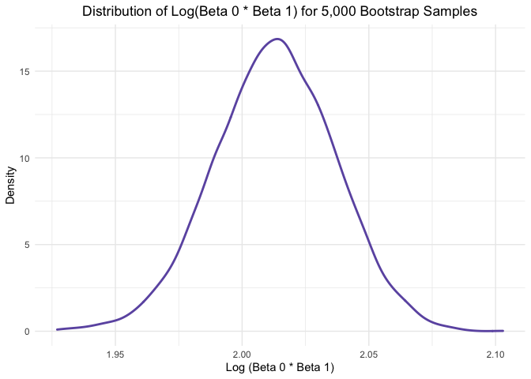

p8105_hw6_jdr2191
================

``` r
library(tidyverse)
library(purrr)
library(modelr)
library(viridis)
```

## Problem 1

Load and clean the data for regression analysis (i.e. convert numeric to
factor where appropriate, check for missing data, etc.).

``` r
birthweight_df = 
  read_csv("birthweight.csv") %>%
  mutate(babysex = factor(babysex, levels = c(1,2))) %>%
  mutate(frace = factor(frace, levels = c(1,2,3,4,8,9))) %>%
  mutate(malform = factor(malform, levels = c(0,1))) %>%
  mutate(mrace = factor(mrace, levels = c(1,2,3,4,8)))
```

Propose a regression model for birthweight.

First I am going to investigate the data we have to determine which
variables might be appropriate for inclusion.

``` r
unique(pull(birthweight_df, pnumlbw))
```

    ## [1] 0

``` r
unique(pull(birthweight_df, pnumsga))
```

    ## [1] 0

-   All values of pnumlbw (previous number of low birth weight babies)
    are 0. Will not be an informative variable for inclusion in the
    model.

-   All values of pnumsga (number of prior small for gestational age
    babies) are 0. Will not be an informative variable for inclusion in
    the model.

At my first pass at a model, I will include variables that I think are
most appropriate based on my existing knowledge about birthweight
predictors.

``` r
model0 = lm(bwt ~ delwt + frace + mrace + smoken + gaweeks + ppbmi + babysex + bhead +
                  blength + parity + momage + wtgain + malform, data = birthweight_df)

summary(model0)
```

    ## 
    ## Call:
    ## lm(formula = bwt ~ delwt + frace + mrace + smoken + gaweeks + 
    ##     ppbmi + babysex + bhead + blength + parity + momage + wtgain + 
    ##     malform, data = birthweight_df)
    ## 
    ## Residuals:
    ##      Min       1Q   Median       3Q      Max 
    ## -1101.27  -183.53    -2.95   173.34  2341.80 
    ## 
    ## Coefficients:
    ##               Estimate Std. Error t value Pr(>|t|)    
    ## (Intercept) -5685.3994   103.0595 -55.166  < 2e-16 ***
    ## delwt           3.0661     0.4128   7.428 1.32e-13 ***
    ## frace2          9.9554    46.1024   0.216 0.829044    
    ## frace3         16.6613    69.2838   0.240 0.809971    
    ## frace4        -51.6672    44.6414  -1.157 0.247180    
    ## frace8         -0.9590    74.0242  -0.013 0.989664    
    ## mrace2       -153.0202    46.0386  -3.324 0.000896 ***
    ## mrace3        -96.8219    71.8887  -1.347 0.178105    
    ## mrace4        -58.8798    45.1130  -1.305 0.191907    
    ## smoken         -4.9007     0.5868  -8.351  < 2e-16 ***
    ## gaweeks        11.5804     1.4654   7.903 3.44e-15 ***
    ## ppbmi          -9.4649     2.5743  -3.677 0.000239 ***
    ## babysex2       28.6284     8.4674   3.381 0.000729 ***
    ## bhead         131.0029     3.4492  37.981  < 2e-16 ***
    ## blength        74.9075     2.0200  37.082  < 2e-16 ***
    ## parity         92.0419    40.4572   2.275 0.022952 *  
    ## momage          0.9297     1.1733   0.792 0.428168    
    ## wtgain          1.0510     0.5723   1.837 0.066346 .  
    ## malform1        7.5425    70.6214   0.107 0.914951    
    ## ---
    ## Signif. codes:  0 '***' 0.001 '**' 0.01 '*' 0.05 '.' 0.1 ' ' 1
    ## 
    ## Residual standard error: 272.5 on 4323 degrees of freedom
    ## Multiple R-squared:  0.718,  Adjusted R-squared:  0.7168 
    ## F-statistic: 611.4 on 18 and 4323 DF,  p-value: < 2.2e-16

Based on these results, it looks like frace, momage, wtgain and malform
are not significant predictors of bwt (all have p-values \< 0.05). I
will remove these variables from the next iteration of the model, and
this iteration will be my proposed model for birthweight.

``` r
model1 = lm(bwt ~ delwt + mrace + smoken + gaweeks + ppbmi + babysex + bhead + blength + 
                  parity, data = birthweight_df)

summary(model1)
```

    ## 
    ## Call:
    ## lm(formula = bwt ~ delwt + mrace + smoken + gaweeks + ppbmi + 
    ##     babysex + bhead + blength + parity, data = birthweight_df)
    ## 
    ## Residuals:
    ##      Min       1Q   Median       3Q      Max 
    ## -1109.86  -182.66    -4.67   176.19  2332.72 
    ## 
    ## Coefficients:
    ##               Estimate Std. Error t value Pr(>|t|)    
    ## (Intercept) -5668.9277   101.1180 -56.063  < 2e-16 ***
    ## delwt           3.6182     0.2842  12.730  < 2e-16 ***
    ## mrace2       -144.4365     9.2061 -15.689  < 2e-16 ***
    ## mrace3        -77.5044    42.2866  -1.833 0.066896 .  
    ## mrace4       -102.3222    18.8609  -5.425 6.11e-08 ***
    ## smoken         -4.8796     0.5857  -8.331  < 2e-16 ***
    ## gaweeks        11.8295     1.4591   8.107 6.68e-16 ***
    ## ppbmi         -12.5487     1.9161  -6.549 6.47e-11 ***
    ## babysex2       27.8875     8.4551   3.298 0.000981 ***
    ## bhead         131.2566     3.4447  38.104  < 2e-16 ***
    ## blength        74.7819     2.0181  37.055  < 2e-16 ***
    ## parity         95.9560    40.3408   2.379 0.017420 *  
    ## ---
    ## Signif. codes:  0 '***' 0.001 '**' 0.01 '*' 0.05 '.' 0.1 ' ' 1
    ## 
    ## Residual standard error: 272.5 on 4330 degrees of freedom
    ## Multiple R-squared:  0.7176, Adjusted R-squared:  0.7169 
    ## F-statistic:  1000 on 11 and 4330 DF,  p-value: < 2.2e-16

``` r
model1 %>%
  broom::tidy()
```

    ## # A tibble: 12 × 5
    ##    term        estimate std.error statistic   p.value
    ##    <chr>          <dbl>     <dbl>     <dbl>     <dbl>
    ##  1 (Intercept) -5669.     101.       -56.1  0        
    ##  2 delwt           3.62     0.284     12.7  1.81e- 36
    ##  3 mrace2       -144.       9.21     -15.7  5.37e- 54
    ##  4 mrace3        -77.5     42.3       -1.83 6.69e-  2
    ##  5 mrace4       -102.      18.9       -5.43 6.11e-  8
    ##  6 smoken         -4.88     0.586     -8.33 1.06e- 16
    ##  7 gaweeks        11.8      1.46       8.11 6.68e- 16
    ##  8 ppbmi         -12.5      1.92      -6.55 6.47e- 11
    ##  9 babysex2       27.9      8.46       3.30 9.81e-  4
    ## 10 bhead         131.       3.44      38.1  3.14e-274
    ## 11 blength        74.8      2.02      37.1  2.56e-261
    ## 12 parity         96.0     40.3        2.38 1.74e-  2

Diagnostics

``` r
modelr::add_residuals(birthweight_df, model1)
```

    ## # A tibble: 4,342 × 21
    ##    babysex bhead blength   bwt delwt fincome frace gaweeks malform menarche
    ##    <fct>   <dbl>   <dbl> <dbl> <dbl>   <dbl> <fct>   <dbl> <fct>      <dbl>
    ##  1 2          34      51  3629   177      35 1        39.9 0             13
    ##  2 1          34      48  3062   156      65 2        25.9 0             14
    ##  3 2          36      50  3345   148      85 1        39.9 0             12
    ##  4 1          34      52  3062   157      55 1        40   0             14
    ##  5 2          34      52  3374   156       5 1        41.6 0             13
    ##  6 1          33      52  3374   129      55 1        40.7 0             12
    ##  7 2          33      46  2523   126      96 2        40.3 0             14
    ##  8 2          33      49  2778   140       5 1        37.4 0             12
    ##  9 1          36      52  3515   146      85 1        40.3 0             11
    ## 10 1          33      50  3459   169      75 2        40.7 0             12
    ## # … with 4,332 more rows, and 11 more variables: mheight <dbl>, momage <dbl>,
    ## #   mrace <fct>, parity <dbl>, pnumlbw <dbl>, pnumsga <dbl>, ppbmi <dbl>,
    ## #   ppwt <dbl>, smoken <dbl>, wtgain <dbl>, resid <dbl>

``` r
modelr::add_predictions(birthweight_df, model1)
```

    ## # A tibble: 4,342 × 21
    ##    babysex bhead blength   bwt delwt fincome frace gaweeks malform menarche
    ##    <fct>   <dbl>   <dbl> <dbl> <dbl>   <dbl> <fct>   <dbl> <fct>      <dbl>
    ##  1 2          34      51  3629   177      35 1        39.9 0             13
    ##  2 1          34      48  3062   156      65 2        25.9 0             14
    ##  3 2          36      50  3345   148      85 1        39.9 0             12
    ##  4 1          34      52  3062   157      55 1        40   0             14
    ##  5 2          34      52  3374   156       5 1        41.6 0             13
    ##  6 1          33      52  3374   129      55 1        40.7 0             12
    ##  7 2          33      46  2523   126      96 2        40.3 0             14
    ##  8 2          33      49  2778   140       5 1        37.4 0             12
    ##  9 1          36      52  3515   146      85 1        40.3 0             11
    ## 10 1          33      50  3459   169      75 2        40.7 0             12
    ## # … with 4,332 more rows, and 11 more variables: mheight <dbl>, momage <dbl>,
    ## #   mrace <fct>, parity <dbl>, pnumlbw <dbl>, pnumsga <dbl>, ppbmi <dbl>,
    ## #   ppwt <dbl>, smoken <dbl>, wtgain <dbl>, pred <dbl>

``` r
birthweight_df %>%
  modelr::add_residuals(model1) %>%
  modelr::add_predictions(model1) %>%
  ggplot(aes(x = pred, y = resid)) +
  geom_point(color = "#21A8BD") +
  labs(x = "Fitted Values", y = "Residuals") + 
  ggtitle("Plot of model residuals against fitted values") +
  theme_minimal() +
  theme(plot.title = element_text(hjust = 0.5)) 
```

<!-- -->

Compare your model to two others:

-   One using length at birth and gestational age as predictors (main
    effects only)

-   One using head circumference, length, sex, and all interactions
    (including the three-way interaction) between these

``` r
model2 = lm(bwt ~ blength + gaweeks, data = birthweight_df)
model3 = lm(bwt ~ bhead + blength + babysex + bhead * blength + bhead * babysex +
                  blength * babysex + bhead * blength * babysex, data = birthweight_df)
```

Make this comparison in terms of the cross-validated prediction error

``` r
cv_df =
  crossv_mc(birthweight_df, 50) %>%
  mutate(
    train = map(train, as_tibble),
    test = map(test, as_tibble))

cv_df2 = 
cv_df %>%
  mutate(
    model1 = map(train, ~lm(bwt ~ delwt + mrace + smoken + gaweeks + 
                                  ppbmi + babysex + bhead + blength + parity, data = .x)), 
    model2 = map(train, ~lm(bwt ~ blength + gaweeks, data = .x)), 
    model3 = map(train, ~lm(bwt ~ bhead + blength * babysex * bhead, data = .x))
  ) %>%
  mutate(
    rmse_model1 = map2_dbl(model1, test, ~rmse(model = .x, data = .y)), 
    rmse_model2 = map2_dbl(model2, test, ~rmse(model = .x, data = .y)),
    rmse_model3 = map2_dbl(model3, test, ~rmse(model = .x, data = .y))
  )
```

    ## Warning in predict.lm(model, data): prediction from a rank-deficient fit may be
    ## misleading

Look at output

``` r
cv_df2 %>% 
  select(
    starts_with("rmse")) %>% 
  pivot_longer(
    everything(),
    names_to = "model", 
    values_to = "rmse",
    names_prefix = "rmse_") %>% 
  mutate(model = fct_inorder(model)) %>% 
    ggplot(aes(x = model, y = rmse, fill = model)) +
    geom_boxplot() +
    scale_fill_viridis_d(option = "D") +
    labs(x = "Model", y = "RMSE", col = "Model") +
    ggtitle("RMSE Plots for All Models") +
    theme_minimal() +
    theme(plot.title = element_text(hjust = 0.5), legend.position = "none")
```

<!-- -->

As seen by the plot, the RMSE for my model (model1) is smaller than the
RMSE for the other two models (model2 and model3), indicating that my
model is a better fit for the data than these other models.

## Problem 2

Importing weather dataset.

``` r
weather_df = 
  rnoaa::meteo_pull_monitors(
    c("USW00094728"),
    var = c("PRCP", "TMIN", "TMAX"), 
    date_min = "2017-01-01",
    date_max = "2017-12-31") %>%
  mutate(
    name = recode(id, USW00094728 = "CentralPark_NY"),
    tmin = tmin / 10,
    tmax = tmax / 10) %>%
  select(name, id, everything())
```

Boostrapping weather dataset.

``` r
weather_df2 =
weather_df %>% 
  modelr::bootstrap(n = 5000) %>% 
  mutate(
    models = map(strap, ~ lm(tmax ~ tmin, data = .x)),
    glance = map(models, broom::glance),
    results = map(models, broom::tidy)) %>%
  unnest(results) %>%
  unnest(glance, names_repair = "universal") %>%
  select(strap, .id, models, r.squared, term, estimate)

weather_df3 = 
  weather_df2 %>%
  mutate(term = if_else(term != "tmin", "Intercept", "tmin"))

wide_weather_df = 
  weather_df3 %>%
  select(term, estimate, .id, r.squared) %>%
  pivot_wider(
    names_from = "term",
    values_from = "estimate"
  ) 

weather_df4 = 
wide_weather_df %>%
  mutate(logb0b1 = log(Intercept)*log(tmin)) %>%
  select(.id, r.squared, logb0b1) 
```

Generate plots of R squared and Log(beta0 \* beta1)

``` r
weather_df4 %>%
  ggplot(aes(x = r.squared)) + 
  geom_density(color = "#6D58B0", size = 1) +
  labs(x = "R Squared", y = "Density") +
  ggtitle("Distribution of R Squared Values for 5,000 Bootstrap Samples") +
  theme_minimal() +
  theme(plot.title = element_text(hjust = 0.5)) 
```

<!-- -->

``` r
weather_df4 %>%
  ggplot(aes(x = logb0b1)) + 
  geom_density(color = "#6D58B0", size = 1) +
  labs(x = "Log (Beta 0 * Beta 1)", y = "Density") +
  ggtitle("Distribution of Log(Beta 0 * Beta 1) for 5,000 Bootstrap Samples") +
  theme_minimal() +
  theme(plot.title = element_text(hjust = 0.5)) 
```

<!-- -->

Identify the 2.5% and 97.5% quantiles to provide 95% confidence
intervals for R squared and Log (Beta 0 \* Beta 1)

``` r
weather_df5 = 
  weather_df4 %>%
  select(r.squared, logb0b1)

sapply(weather_df5, function(x) quantile(x, probs = c(0.025, 0.975))) %>%
  knitr::kable()
```

|       | r.squared |  logb0b1 |
|:------|----------:|---------:|
| 2.5%  | 0.8940627 | 0.010528 |
| 97.5% | 0.9271300 | 0.132867 |
